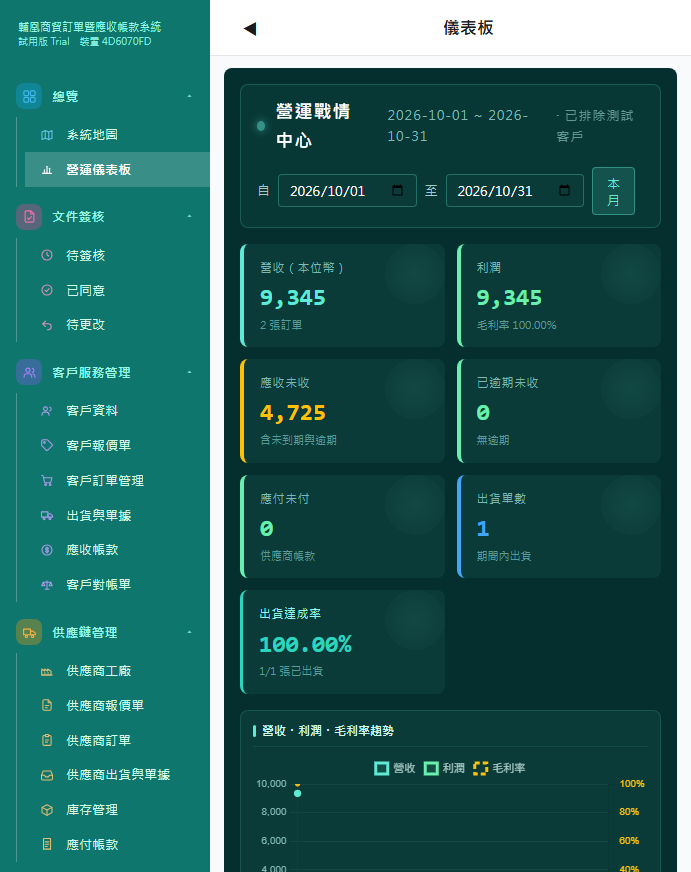
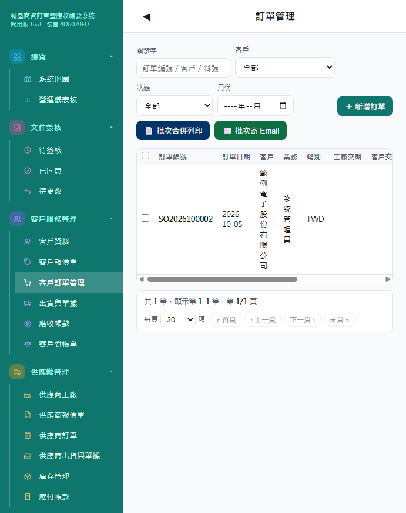
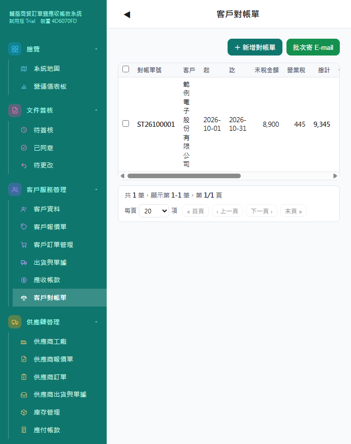
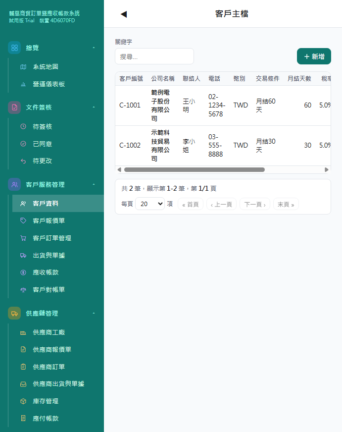

# 輔凰商貿系統 Fu-Huang Trade ERP

> 貿易訂單暨應收應付管理系統 —— 專為中小型貿易公司打造的一體化營運平台

輔凰商貿系統以實際貿易公司的作業流程為藍本，將 **客戶服務**（報價 → 訂單 → 出貨 → 應收 → 對帳）與 **供應鏈管理**（供應商報價 → 採購 → 出貨 → 庫存 → 應付）整合在同一平台，並內建電子簽核、PDF 表單、批次 Email 與營運儀表板，讓一張訂單從報價到收款全程可追蹤。


***

## 畫面截圖

| 營運儀表板 | 客戶訂單管理 |
| --- | --- |
|  |  |

| 客戶對帳單 | 客戶資料 |
| --- | --- |
|  |  |

> 截圖為乾淨示範資料，實際使用以正式安裝版為準。

***

## 功能特色

### 客戶服務管理


* 客戶資料（統一編號、聯絡資訊、付款條件）

* 客戶報價單 → 一鍵帶入客戶訂單

* 客戶訂單管理（訂單明細、交期、客戶採購單號）

* 出貨與單據（出貨單一式兩份 A4、電子簽核：業務 → 會計 → 主管）

* 應收帳款（總未收／逾期未收／本月已收）

* 客戶對帳單（區間列帳、加總欄位、批次寄 Email）

### 供應鏈管理


* 供應商工廠資料

* 供應商報價單 → 產品料號

* 供應商訂單（批次合併列印、批次寄 Email）

* 供應商出貨與單據

* 庫存管理（進出貨、庫存價值）

* 應付帳款（總未付／本月應付）

### 電子簽核


* 文件簽核流程：送核 → 多層核決（可多選主管）→ 核准／駁回／退回修改

* 送核人、核決人、每關耗時、核決意見全程紀錄

* 文件狀態標籤（待簽核／已同意／已否決／待修改）

### 系統管理


* 多使用者與角色權限（super 系統管理者／一般使用者）

* 系統參數（金額小數位、公司資訊、表單模板）

* 表單模板所見即所得編輯（TipTap）

* 系統備份與還原、PDF 表單指紋驗證

### 營運儀表板


* 9 張圖表戰情室（營收、應收、庫存、訂單、對帳等）

* 每張卡片可自選期間（預設當月）


***

## 系統需求


| 項目   | 單機版             | 網路版                    |
| ---- | --------------- | ---------------------- |
| 作業系統 | Windows 10 / 11 | Windows Server / Linux |
| 執行環境 | Node.js 22+     | Node.js 22+            |
| 記憶體  | 4 GB 以上         | 8 GB 以上                |
| 網路   | 不需（本機使用）        | 需固定 IP／域名              |


***

## 快速啟動（開發模式）


```
# 1. 安裝相依套件
npm install

# 2. 建置前端
npm run build

# 3. 啟動服務
npm start

# 4. 開啟瀏覽器
# http://localhost:5200
# 首次啟動（無任何使用者時）會自動建立初始管理員並產生「一次性密碼」，密碼顯示於啟動終端機日誌（[auth] 已建立初始管理員...），登入後請立即變更密碼。或於啟動前以環境變數指定初始管理員（推薦）：BOOTSTRAP_ADMIN_EMP_ID=admin BOOTSTRAP_ADMIN_PASSWORD=YourP@ssw0rd npm start
```

> 正式使用建議直接下載一鍵安裝包（見下節），免自行安裝 Node.js 環境。


***

## 試用安裝包（GitHub Releases）

前往 [Releases](../../releases) 下載：


| 檔案                             | 說明               |
| ------------------------------ | ---------------- |
| `Fu-Huang-Trade_v1.0.50_Standalone_setup.exe` | 一鍵安裝（30 天試用、2 席） |

**試用版限制**：30 天試用期、2 席使用者；功能完整不閹割。期滿請聯絡我們購買正式授權。


***

## 商業模式


```
試用（免費 30 天） → 單機版（盒裝授權） → 網路版（多人連線）
```


***

## 技術架構


* 後端：Node.js 22 + Express

* 資料庫：SQLite（better-sqlite3）＋ MySQL 平行驗證

* 前端：原生 SPA（無框架依賴，輕量快速）

* 圖表：Chart.js

* 文件：PDFKit（PDF 表單產生）、TipTap（所見即所得模板編輯）

* 郵件：批次 Email（SMTP）


***

## 目錄結構


```
├── server.js            # 伺服器入口
├── lib/                 # 共用函式庫（auth / pdf / mail / backup …）
├── routes/              # API 路由
├── src/                 # 前端源碼
├── public/              # 靜態資源
├── migrations/          # 資料庫結構
├── scripts/             # 工具腳本
└── tests/               # 自動化測試
```


***

## 授權

© 2026 輔凰有限公司（Fu-Huang Co., Ltd.）

本專案以 **試用授權** 提供下載：


* ✅ 允許：下載、安裝、試用評估（30 天）

* ❌ 禁止：未經授權之商業使用、轉售、再散佈、移除版權宣告

正式授權（單機版／網路版）請與我們聯絡。


***

## 聯絡我們


* 公司：輔凰有限公司

* 信箱：hello@fuhuang.com.tw

* 網站：www.fuhuang.com.tw
